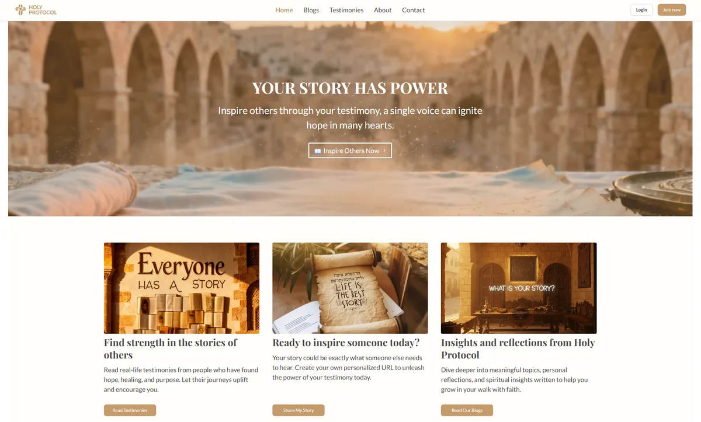
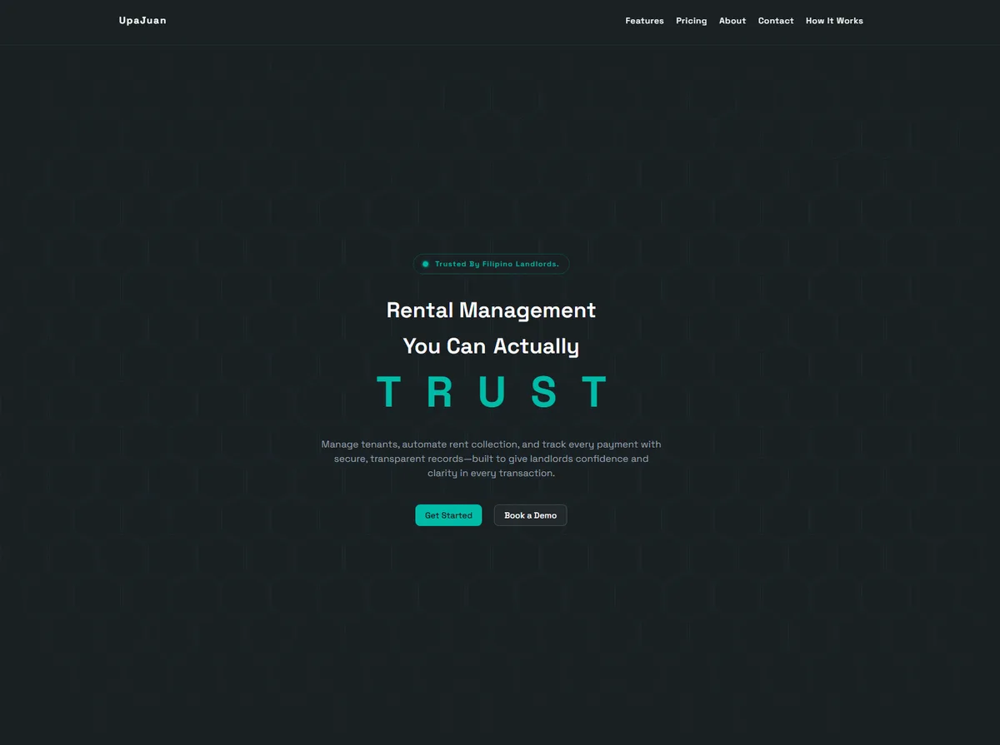
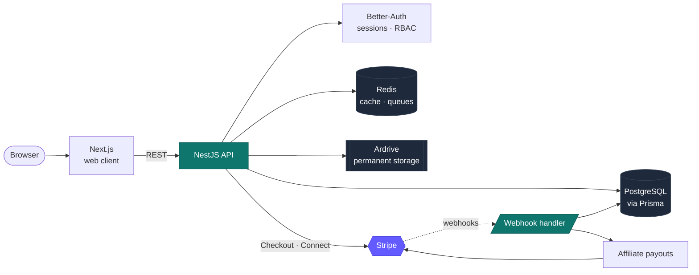

  
   
  

**Full-stack developer, backend-focused.** I work on the parts of a product that quietly ruin your week when they break — payments, auth, tenant isolation, and the data model holding all of it up.

Most of what I ship is TypeScript end to end: NestJS and PostgreSQL on the server, Next.js on the front, Stripe wherever money moves. Based in the Philippines (UTC+8), working remotely.

**Right now** I'm building a multi-tenant booking platform at Vytal Automated — per-tenant Stripe payouts, row-level security, and access codes that unlock real machines in the real world.

**I'm open to remote roles and freelance work.**

---

## Selected work

<table>
  <tr>
    <td width="50%" valign="top">
      <h3><a href="https://holyprotocol.com">Holy Protocol</a></h3>
      
      
A global platform for sharing and preserving faith-based testimonies. I owned the backend: REST APIs in NestJS, Better-Auth, Stripe Connect for payments and affiliate payouts, and decentralized storage on Ardrive so the records outlive whoever is hosting them.

      

        
        
        
        
      

      
<b>Live in production</b> · source under NDA 
      <a href="https://holyprotocol.com">See it live →</a>

    </td>
    <td width="50%" valign="top">
      <h3><a href="https://denmarkcrisostomo.dev">UpaJuan</a></h3>
      
      
Rental management for Filipino landlords, built solo. The hard part: most rent arrives as a GCash or bank P2P transfer, and those don't come with a webhook. Solved with per-tenant QR amounts, EMV QR Ph rewriting, and a fuzzy-match fallback for reconciliation.

      

        
        
        
        
      

      
<b>Built solo</b> 
      <a href="https://denmarkcrisostomo.dev/blog/why-i-built-upajuan">Why I built it →</a>

    </td>
  </tr>
</table>

<b>Architecture — how Holy Protocol fits together</b>

 

The interesting constraints here were permanence and money. Testimonies had to outlive the company hosting them, which is what pushes content onto Ardrive rather than object storage. And affiliate payouts meant Stripe Connect, which meant the webhook handler — not the request that started the checkout — is the thing that owns the write.

### Vytal Automated — multi-tenant SaaS

Booking and access control for self-service automated machines across multiple locations. Tenant isolation enforced with row-level security, Stripe payments wired to automated access-credential generation, and Next.js dashboards gated through a NestJS auth API. Four apps in a Turborepo.

`NestJS` · `Next.js` · `Payload CMS` · `PostgreSQL` · `Redis` · `Turborepo` · `Stripe`

Client codebase — private.

### Clairvoyance — threat intelligence

Surfaces threats and vulnerabilities before they become incidents. I built backend features on the MERN stack — JWT auth, role-based authorization, and integrations with Shodan, VirusTotal, Censys, Fofa, and Urlscan.

`MongoDB` · `Express` · `React` · `Node.js` · `TypeScript`

Earlier: **BytesMe**, a URL shortener with admin and user dashboards, and **AIROK**, a Python computer-vision bot that cut a game's resource grind by about 90% — the project that taught me automation is mostly patience.

---

## What I work with

**Backend**

**Frontend**

**Infra & tooling**

Also comfortable in **Zod**, **Better Auth**, **Payload CMS**, **Upstash**, **Postman**, **PHP**, **Laravel**, **Python**, **Strapi**, and **WordPress**.

The short version: I'm strongest where the data model meets the money.

---

## Contribution activity

  <picture>
    <source media="(prefers-color-scheme: dark)" srcset="https://raw.githubusercontent.com/denmarkcrisostomo/denmarkcrisostomo/output/github-snake-dark.svg">
    <source media="(prefers-color-scheme: light)" srcset="https://raw.githubusercontent.com/denmarkcrisostomo/denmarkcrisostomo/output/github-snake.svg">
    
  </picture>

---

## A note on the empty repo list

Most of my recent work is client code under NDA, so it isn't here. Instead of pinning toy projects, I write up the interesting problems — architecture, tradeoffs, and the parts that didn't work the first time. The write-ups on my site are the honest version of a code sample. Happy to walk through any of it on a call.

---

## Get in touch

Currently available for remote full-time roles and freelance projects.
