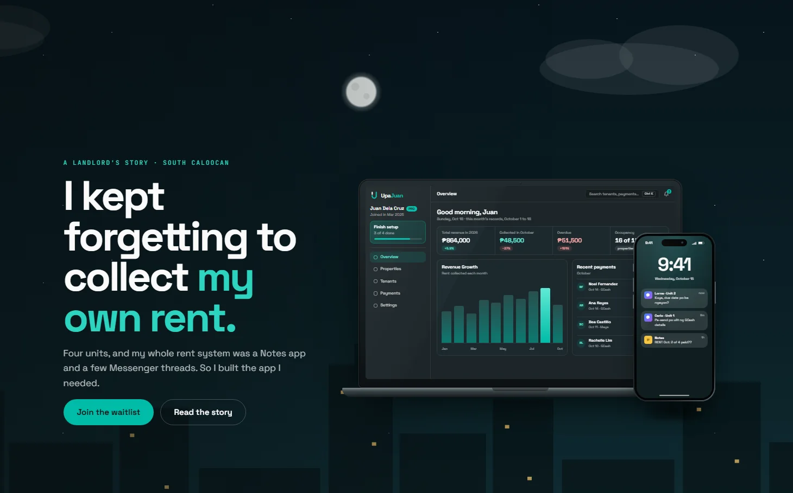
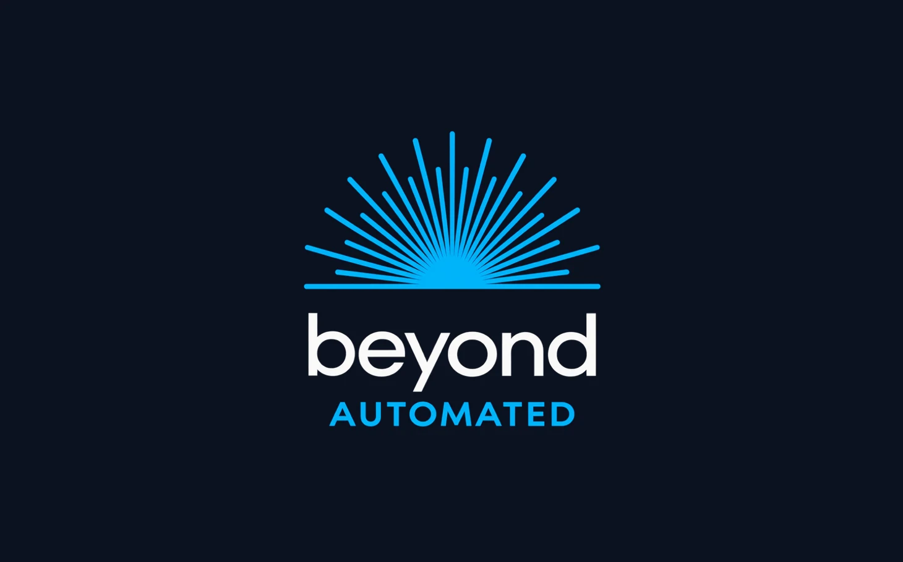
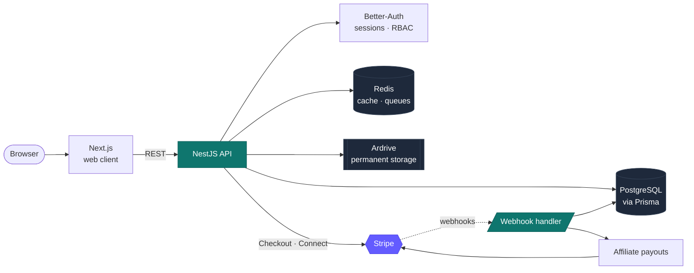
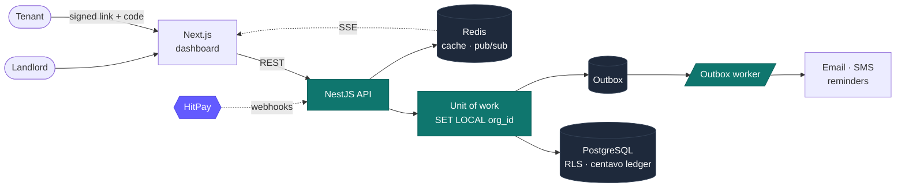

  
   
  

**Full-stack developer, backend-focused.** I work on the parts of a product that quietly ruin your week when they break — payments, auth, tenant isolation, and the data model holding all of it up.

Most of what I ship is TypeScript end to end: NestJS and PostgreSQL on the server, Next.js on the front, Stripe wherever money moves. Based in the Philippines (UTC+8), working remotely.

**Right now** I'm building **UpaJuan**, a rental platform for Filipino landlords, designed so that a cross-tenant leak or a half-written payment can't happen by construction. Most recently I shipped a multi-tenant booking platform at Beyond Automated (formerly Vytal Automated) — per-tenant Stripe payouts, row-level security, and access codes that unlock real machines in the real world.

**I'm open to remote roles and freelance work.**

---

## Selected work

<table>
  <tr>
    <td width="50%" valign="top">
      <h3><a href="https://holyprotocol.com">Holy Protocol</a></h3>
      
      
A global platform for sharing and preserving faith-based testimonies. I owned the backend: REST APIs in NestJS, Better-Auth, Stripe Connect for payments and affiliate payouts, and decentralized storage on Ardrive so the records outlive whoever is hosting them.

      

        
        
        
        
      

      
<b>Live in production</b> · source under NDA 
      <a href="https://holyprotocol.com">See it live →</a>

    </td>
    <td width="50%" valign="top">
      <h3><a href="https://www.upajuan.com">UpaJuan</a></h3>
      
      
Rental management for Filipino landlords, built solo. Rent here moves as GCash, Maya or bank transfers straight to the landlord, so UpaJuan never holds the money — it keeps the books. That makes the data the product: every landlord's records have to stay theirs, and every balance has to add up.

      
So the guarantees live in the database. Postgres row-level security isolates each landlord, a unit of work is the only way to touch the DB, and money is a ledger of charges, payments and allocations in integer centavos.

      

        
        
        
        
        
        
      

      
<b>Built solo</b> · in progress 
      <a href="https://denmarkcrisostomo.dev/blog/why-i-built-upajuan">Why I built it →</a>

    </td>
  </tr>
  <tr>
    <td width="50%" valign="top">
      <h3><a href="https://beyondautomated.com">Beyond Automated</a></h3>
      
      
A multi-tenant CRM and booking platform for service businesses, starting with spray tan vending machines. A customer books and pays online, and checkout issues the PIN that unlocks the machine's door.

      
Payload CMS is the only service that touches the database. NestJS goes through its API, so there is one schema owner and one set of migrations. Tenants are isolated in NestJS, in Payload's access rules, and by Postgres row-level security. Each business is paid out through Stripe Connect, and webhooks are deduplicated by event ID and retried on failure.

      

        
        
        
        
        
        
      

      
<b>Shipped</b> · client codebase, private 
      <a href="https://beyondautomated.com">Visit Beyond Automated →</a>

    </td>
    <td width="50%" valign="top">
      <h3>Clairvoyance</h3>
      
<i>Threat Intelligence Web Application</i>

      
Surfaces threats and vulnerabilities before they become incidents. I built backend features on the MERN stack — JWT auth, role-based authorization, and integrations with Shodan, VirusTotal, Censys, Fofa, and Urlscan.

      

        
        
        
        
        
      

    </td>
  </tr>
</table>

Earlier: **BytesMe**, a URL shortener with admin and user dashboards, and **AIROK**, a Python computer-vision bot that cut a game's resource grind by about 90% — the project that taught me automation is mostly patience.

<b>Architecture — how Holy Protocol fits together</b>

 

The interesting constraints here were permanence and money. Testimonies had to outlive the company hosting them, which is what pushes content onto Ardrive rather than object storage. And affiliate payouts meant Stripe Connect, which meant the webhook handler — not the request that started the checkout — is the thing that owns the write.

```mermaid
flowchart LR
  U([Browser]) --> N[Next.js<br/>web client]
  N -->|REST| A[NestJS API]

  A --> AU[Better-Auth<br/>sessions · RBAC]
  A --> R[(Redis<br/>cache · queues)]
  A --> DB[(PostgreSQL<br/>via Prisma)]
  A --> AR[[Ardrive<br/>permanent storage]]

  A -->|Checkout · Connect| S{{Stripe}}
  S -.->|webhooks| W[/Webhook handler/]
  W --> DB
  W --> P[Affiliate payouts]
  P --> S

  classDef api fill:#0f766e,stroke:#0b5e59,color:#ffffff
  classDef store fill:#1e293b,stroke:#334155,color:#ffffff
  classDef ext fill:#635bff,stroke:#4f46e5,color:#ffffff
  class A,W api
  class DB,R,AR store
  class S ext
```

<b>Architecture — how UpaJuan fits together</b>

 

The rule for UpaJuan is that the unsafe thing should be impossible, not just avoided. Every request sets the landlord's organization on its transaction, and Postgres row-level security filters every query by it, so a missing `WHERE` clause returns nothing instead of someone else's tenants. The unit of work is the only path to the database, so there's no write that isn't inside a transaction. Emails, SMS reminders and notifications go through a transactional outbox, which means a rolled-back payment can't send a receipt.

Redis is in there for cache, counters and pub/sub fan-out for live updates, and never as the source of truth. Postgres `LISTEN/NOTIFY` would have kept a connection open and stopped Neon from scaling to zero.

```mermaid
flowchart LR
  L([Landlord]) --> APP[Next.js<br/>dashboard]
  T([Tenant]) -->|signed link + code| APP
  APP -->|REST| API[NestJS API]

  API --> UOW[Unit of work<br/>SET LOCAL org_id]
  UOW --> DB[(PostgreSQL<br/>RLS · centavo ledger)]
  UOW --> OB[(Outbox)]
  OB --> WK[/Outbox worker/]
  WK --> MSG[Email · SMS<br/>reminders]

  API --> R[(Redis<br/>cache · pub/sub)]
  R -.->|SSE| APP

  PAY{{HitPay}} -.->|webhooks| API

  classDef api fill:#0f766e,stroke:#0b5e59,color:#ffffff
  classDef store fill:#1e293b,stroke:#334155,color:#ffffff
  classDef ext fill:#635bff,stroke:#4f46e5,color:#ffffff
  class API,UOW,WK api
  class DB,OB,R store
  class PAY ext
```

---

## What I work with

**Backend**

**Frontend**

**Infra & tooling**

Also comfortable in **Zod**, **Better Auth**, **Payload CMS**, **Upstash**, **Resend**, **Postman**, **PHP**, **Laravel**, **Python**, **Strapi**, and **WordPress**.

The short version: I'm strongest where the data model meets the money.

---

## Contribution activity

  <picture>
    <source media="(prefers-color-scheme: dark)" srcset="https://raw.githubusercontent.com/denmarkcrisostomo/denmarkcrisostomo/output/github-snake-dark.svg">
    <source media="(prefers-color-scheme: light)" srcset="https://raw.githubusercontent.com/denmarkcrisostomo/denmarkcrisostomo/output/github-snake.svg">
    
  </picture>

---

## A note on the empty repo list

Most of my recent work is client code under NDA, so it isn't here. Instead of pinning toy projects, I write up the interesting problems — architecture, tradeoffs, and the parts that didn't work the first time. The write-ups on my site are the honest version of a code sample. Happy to walk through any of it on a call.

---

## Get in touch

Currently available for remote full-time roles and freelance projects.
